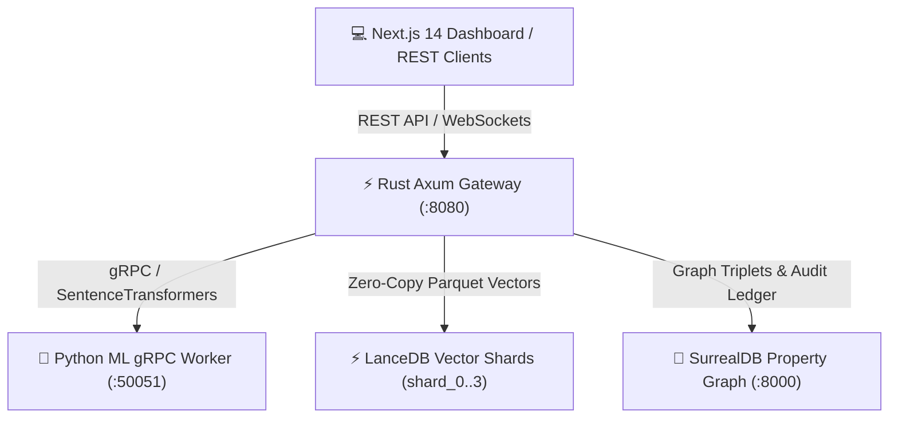

# 🛡️ Auditable Machine Unlearning Engine

An enterprise-grade, real-time machine unlearning engine built with **SISA (Sharded, Isolated, Sliced, and Aggregated)** vector architecture, **SurrealDB 2.0** property graph relation tracking, **LanceDB** zero-copy vector storage, and **Ed25519-signed SHA-256 Merkle tree receipts** for compliance audits.

---

## 📐 System Architecture Overview



The system separates inference, vector indexing, and property graph tracking into decoupled, highly efficient services:
- **Client (Next.js 14)**: Cybernetic dark-mode dashboard displaying live SISA shard topology, particle disintegration effects upon unlearning, and cryptographic proof verification drawers.
- **Gateway (Rust Axum)**: Handles input validation, per-shard `RwLock` concurrency control, batch orchestration via `tokio::task::JoinSet`, and Ed25519 cryptographic signing.
- **ML Worker (Python gRPC)**: Serves PyTorch / `SentenceTransformers` (`all-MiniLM-L6-v2`) embeddings and NLP triplet extractions over HTTP/2 gRPC.
- **Vector Storage (LanceDB)**: SISA-sharded vector storage partitions embeddings across `shard_0` through `shard_3`.
- **Property Graph (SurrealDB 2.0)**: Embedded or server-backed graph storage tracking entity relationships (`concept`, `KNOWLEDGE`, `PURGED_FROM`) and persistent audit logs (`audit_certificates`).

---

## 🔒 SISA Machine Unlearning & Cryptographic Audit Flow

1. **Deterministic SISA Partitioning**:
   - Entities are deterministically mapped to a specific SISA shard via `hash(entity_id) % num_shards`.
   - Modifying or deleting data on one shard leaves all other independent shard models/indices untouched.

2. **Graph Triplet Detachment & Micro-Purging**:
   - Upon receiving an unlearning request for an `entity_id`, the engine acquires an exclusive write lock (`RwLock`) on the target shard.
   - All associated vectors in LanceDB matching `entity_id` are deleted.
   - All corresponding graph triplets and `concept` nodes in SurrealDB are detached and purged.

3. **Merkle Root Calculation & Ed25519 Digital Signature**:
   - A cryptographic SHA-256 Merkle root hash is generated: `Sha256(entity_id:shard_id:timestamp_epoch)`.
   - The Merkle root is digitally signed using an **Ed25519 keypair**: `signature = Sign(merkle_root_hash)`.
   - The resulting `AuditCertificate` is broadcast to WebSocket clients and saved to SurrealDB's `audit_certificates` table.

---

## 🚀 Quickstart with Docker

Spin up the entire stack (SurrealDB, ML Worker, Rust Gateway, and Next.js Frontend) using a single command:

```bash
docker compose up --build
```

Access the services:
- **Next.js Dashboard**: `http://localhost:3000`
- **Rust Axum Gateway**: `http://localhost:8080`
- **Python ML Worker (gRPC)**: `localhost:50051`
- **SurrealDB Server**: `http://localhost:8000`

---

## 🛠️ Manual Local Development Setup

### Prerequisites
- **Rust** 1.78+ (`cargo`)
- **Python** 3.11+ (`pip`)
- **Node.js** 20+ (`npm`)
- **protoc** (Protobuf compiler)

### 1. Start Python ML gRPC Worker
```bash
cd ml_worker
pip install -r requirements.txt
python main.py
```

### 2. Start Rust Axum Gateway
```bash
cd rust_gateway
cargo run --release
```

### 3. Start Next.js Frontend
```bash
cd frontend
npm install
npm run dev
```

---

## 📚 API Reference Table

### REST Endpoints (`http://localhost:8080`)

| Method | Endpoint | Description | Request Body | Response Body |
| :--- | :--- | :--- | :--- | :--- |
| `GET` | `/health` | Gateway health check status | None | `200 OK` (String) |
| `POST` | `/api/v1/ingest` | Ingest single text document, generate embedding & triplets | `{ "id": "doc_101", "entity_id": "user_9012", "text": "..." }` | `{ "id": "...", "shard_id": 2, "triplets_extracted": 3, "status": "SUCCESSFULLY_INGESTED" }` |
| `POST` | `/api/v1/ingest/batch` | Concurrently ingest batch array of documents | `[ { "id": "...", "entity_id": "...", "text": "..." } ]` | `{ "results": [...], "total_processed": N, "status": "BATCH_COMPLETED" }` |
| `POST` | `/api/v1/unlearn` | Purge target entity vectors and graph triplets | `{ "entity_id": "user_9012" }` | `{ "entity_id": "user_9012", "shard_id": 2, "audit_certificate": {...}, "status": "PURGED_AND_VERIFIED" }` |
| `POST` | `/api/v1/unlearn/batch` | Concurrently unlearn batch array of entity IDs | `["user_9012", "patient_3310"]` | `{ "results": [...], "total_processed": N, "status": "BATCH_UNLEARN_COMPLETED" }` |
| `GET` | `/api/v1/audit/:entity_id/:shard_id` | Query and verify cryptographic Merkle audit proof | None | `{ "audit_certificate": {...}, "is_valid": true, "message": "..." }` |

### Error Responses

If an entity does not exist or fails regex validation (`^[a-zA-Z0-9_-]{3,64}$`), `/api/v1/unlearn` returns `404 Not Found` or `400 Bad Request`:
```json
{
  "error": "ENTITY_NOT_FOUND",
  "message": "Entity 'user_9012' does not exist in graph or vector storage."
}
```

### WebSocket API (`ws://localhost:8080/ws`)

Connects clients to real-time engine telemetry. Sends 30-second ping heartbeats to drop zombie connections.

**Client Broadcast Events**:
- `NodeIngested`: Broadcast when new entity vector is stored.
- `NodeDeleted`: Broadcast when entity vector micro-purge finishes.
- `AuditGenerated`: Broadcast when new Ed25519 signed Merkle certificate is issued.

---

## 📜 License

MIT License. Built for Auditable AI and SISA Machine Unlearning Compliance.


